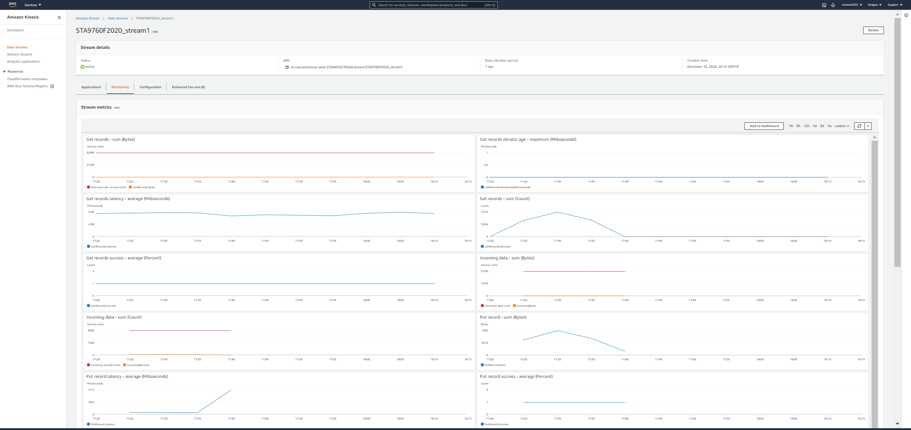
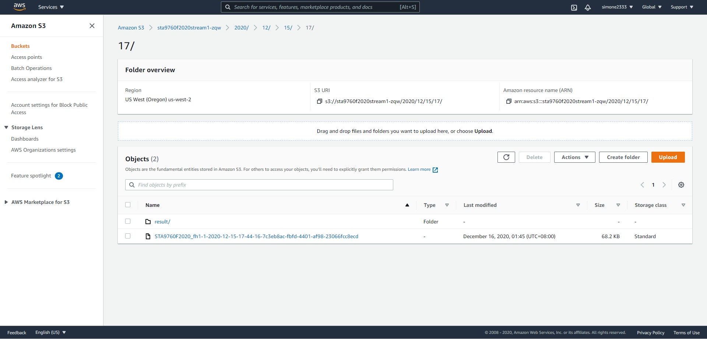

# STA9760-yfinance
STA9760 project3

For this project, Lambda functions and yfinance `history` function were used to grab pricing information for each of the following stocks on Tuesday, December 1st 2020, at a five minute interval.

Facebook (FB) 
Shopify (SHOP)  
Beyond Meat (BYND)  
Netflix (NFLX)  
Pinterest (PINS)  
Square (SQ) 
The Trade Desk (TTD)  
Okta (OKTA) 
Snap (SNAP) 
Datadog (DDOG)  

Kinesis Firehose Delivery Stream transforms records and streams them into an S3 bucket. I set up a Glue crawler and run AWS Athena queries against the data to get the highest hourly stock “high” per company from the list above.

### AWS Kinesis configuration page

### Kinesis Data Firehose Delivery Stream Monitoring

